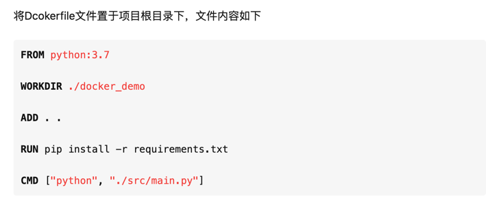

# docker常用命令
## 不错的docker 学习课程推荐
* https://yeasy.gitbook.io/docker_practice/container/attach_exec
* https://www.maxlist.xyz/2020/01/11/docker-flask/ (亲手敲过代码可以success)
## dockerfile
 | [参考地址](http://www.baidu.com)
* 1: ROM <基础镜像>。所谓定制镜像，那一定是以一个镜像为基础。FROM 指令用来指定以哪个镜像作为基础镜像生成新的镜像。这里我们将官方Python的3.7版本镜像作为基础镜像
* 2: WORKDIR <工F作目录路径> 。 使用 WORKDIR 指令可以来指定镜像中的工作目录（或者称为当前目录），以后各层的当前目录就被改为指定的目录
* 3: ADD <源路径> <目标路径>。使用ADD指令可以将构建上下文目录中的源路径目录复制到镜像内的 <目标路径> 位置。第一个参数“.”代表Dockerfile所在的目录，即python项目dockerdemo下所有的目录（不包括docker_demo自身）。第二个参数“.”代表镜像的工作目录docker_demo。所以该行命令会将python项目docker_demo目录下的所有文件复制到镜像的docker_demo目录下。这样docker镜像中就拥有了一份docker_demo python项目。
* 4: EXPOSE  启动容器时候需要暴露出来的端口
* RUN 指令是用来执行命令行命令的。这里直接安装requirements.txt 中指定的任何所需软件包 ,eg: RUN pip install -r requirements.txt
* CMD 指令是容器启动命令，这里是在容器启动时通过python运行 main.py

## docker 常用指令
* 根据dockerfile 创建镜像 --> docker build -t image_name:image_version
* docker 进入容器 --> docker exec -it contair_id bash
* docker 进入镜像 -->

## 多个模块打包景象？

## 常见问题
* docker restart images_id  怎么解决
  * 通过docker logs container_id 查看日志
* docker mysql 制作流程
  * docker pull mysql:latest
  * docker run -d -p 3306:3306 --name container_name -e MYSQL\_ROOT\_PASSWORD=123456 mysql:latest

